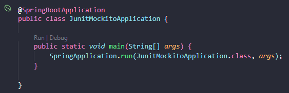

# Api com cobertura de testes automatizados

## Descrição do Projeto

Utilizando boas práticas de cobertura de testes automatizados o projeto consiste na criação de uma api para cadastro, leitura, atualizar e deletar usuários.

Para realização dos testes são utilizados o [JUnit5](https://junit.org/junit5/) e o [Mockito](https://site.mockito.org/).

Segue documentação de teste para o [springboottest](https://docs.spring.io/spring-boot/docs/1.5.3.RELEASE/reference/html/boot-features-testing.html)

Projeto baseado no Code Castle - [Testes com JUnit5 Mockito e Java](https://www.youtube.com/watch?v=1iIgKGTqg0Q&list=PLA8Qj9w4RGkWgyYa485pgf-VAoJgL4rW1&index=1)

## End-Points do Projeto

- [GET] consultar 1 usuário especifico, passar id por parametro na requisição: {url}/user/{id}

- [GET] consultar todos os livros: {url}/user

- [POST] criar usuário: {url}/user/create
``` Json Body
{
    "name": "type string",
    "email": "type string",
    "password": "type string",
}
```

- [Put] atualizar usuário, passar id por parametro da requisição: {url}/user/update/{id}
``` Json Body
{
    "name": "type string",
    "email": "type string",
    "password": "type string",
}
```

- [DELETE] deletar usuário, passar id por parametro da requisição: {url}/user/delete/{id}

## Descrição da Api
### Executar Api localmente:
- Para clonar o projeto: git clone https://github.com/TaylanTorres09/api-test-junit-mockito.git
- Para Executar o projeto precisasse:
    - Java [JDK](https://www.oracle.com/java/technologies/downloads/#java17). Este projeto está usando a versão 17.
    - Para perfil de Teste, Banco [H2](https://www.h2database.com/html/main.html) utilizado em memória, coloquei neste pois é um banco de fácil configuração e utilização.

- Extensões do [vscode](https://code.visualstudio.com/) utilizadas:
    - [Debugger for Java](https://marketplace.visualstudio.com/items?itemName=redhat.java)
    - [Spring Boot Extension Pack](https://marketplace.visualstudio.com/items?itemName=Pivotal.vscode-boot-dev-pack)

- Configuração do banco de dados de Teste.


- Para executar os teste da aplicação, você pode executar todos ou de um por um.


- Na pasta src/main, execute o arquivo JunitMockitoApplication.java



- Para testar a api você pode utilizar ferramentas de client como:
    - [Postman](https://www.postman.com/)
    - [Insomnia](https://insomnia.rest/download)
    - Extensão do VsCode [Thunder Client](https://marketplace.visualstudio.com/items?itemName=rangav.vscode-thunder-client)
    - Ou outra de sua preferência.

## Autor
<a href="https://www.linkedin.com/in/taylan-torres" target="_blank"></a> 